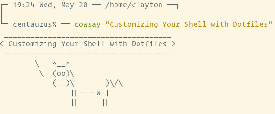
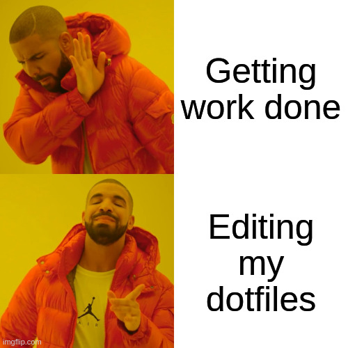
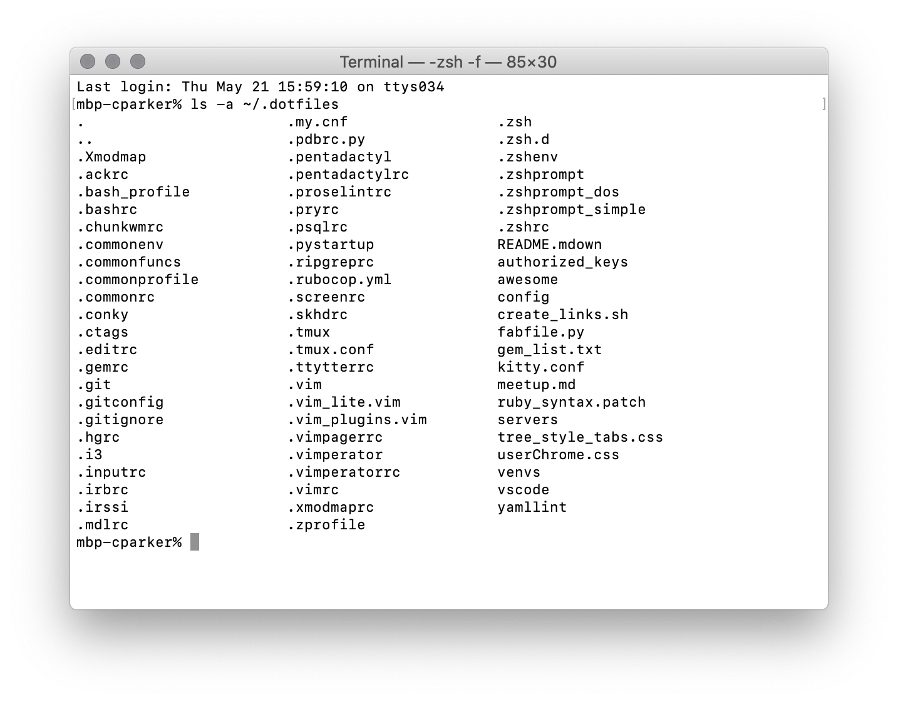
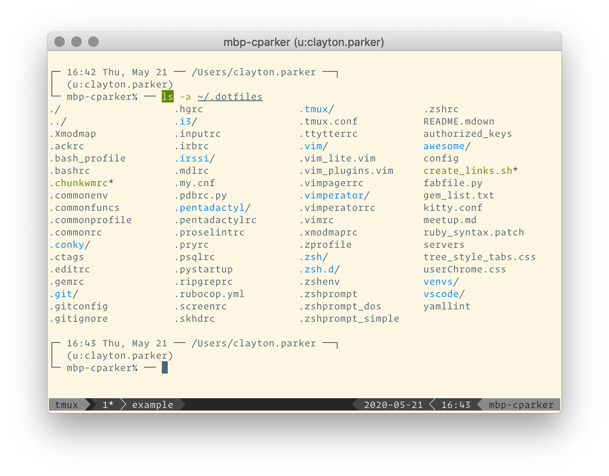
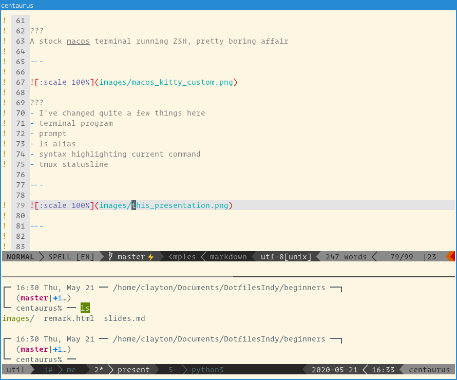

layout: true

---
class: middle, center




### Customizing Your Shell with Dotfiles
### [FayettePy Meetup][fayettepy] | 05.2020 | Clayton Parker

???
Let's talk about dotfiles, a subject near and dear to my heart

---
class: middle, center

# Who Am I?


[@claytron][twitter-claytron] on the internets and IRL

My [dotfiles][dotfiles-claytron]

???
- known as claytron on the internet and in real life
- Links to my dotfiles and more. I'll share the slides after.
- dotfiles are 17 years old, up on github, and still growing
- actually how I learned how to use git / github

---
class: middle, center

# Why?

Make life easier<sup>†</sup>, save settings, personalize your shell



<sub><sup>†</sup>as long as you don't obsess about it too much!</sub>

???
- Save some configuration that you repeat
- Customize things to make it work for you
- This is a highly personal thing
- You can go pretty far down the rabbit hole here...

---
class: middle, center
# Examples

???
Before we dive in too deep, some examples

---
class: middle, center

Vanilla macOS terminal



???
A stock macos terminal running ZSH, pretty boring affair

---
class: middle, center

Customized Kitty terminal, running tmux, with customized prompt, theme, fonts and aliases



???
- I've changed quite a few things here
- terminal program
- colorscheme
- prompt
- ls alias
- syntax highlighting current command
- tmux statusline

---
class: middle, center

Writing this presentation in vim on Linux running i3 window manager



???
- On a linux machine
- Writing this presentation in vim
- Heavily customized but portable

---
class: middle, center

# Pick A Shell

Bash (widely available standard),

ZSH (superset of Bash)

Fish (newer generation with more advanced defaults)

Other more esoteric options which might have less community support


???
- There are a lot of options out there
- Bash or ZSH are some classic options
- The more esoteric, the harder life might be
- Fish is powerful, but not available on every machine

---
class: middle, center

# Start Configuring

If you do something repetitively, add to your dotfiles

???
Ever do something more than a few times?
Then configure it!


---
class: middle, left

Stock `ls` with no customization

```sh
% ls
images  remark.html  slides.md
```

???
Stock `ls` doesn't give us much info or context


---
class: middle, left

Manually specify the switches to get more information

```sh
% ls -alhF
total 24K
drwxr-xr-x 4 clayton clayton 4.0K May 21 16:55 ./
drwxrwxr-x 3 clayton clayton 4.0K May 20 13:47 ../
drwxrwxr-x 8 clayton clayton 4.0K May 21 16:55 .git/
drwxr-xr-x 2 clayton clayton 4.0K May 21 16:46 images/
-rw-rw-r-- 1 clayton clayton 1.5K May 21 14:44 remark.html
-rw-rw-r-- 1 clayton clayton 2.1K May 21 16:55 slides.md
```

???
- Running the command manually
- Lot's more useful info
- Tedious to write out each time

---
class: middle, left

Add an alias and load the changes (or restart your terminal)

```sh
% vim ~/.zshrc
alias ll="ls -alhF"

% source ~/.zshrc
```

???
- Edit your zshrc
- Add the alias
- source the file (or open a new terminal)

---
class: middle, left

Now you don't need to always specify the switches

```sh
% ll
total 24K
drwxr-xr-x 4 clayton clayton 4.0K May 21 16:55 ./
drwxrwxr-x 3 clayton clayton 4.0K May 20 13:47 ../
drwxrwxr-x 8 clayton clayton 4.0K May 21 16:55 .git/
drwxr-xr-x 2 clayton clayton 4.0K May 21 16:46 images/
-rw-rw-r-- 1 clayton clayton 1.5K May 21 14:44 remark.html
-rw-rw-r-- 1 clayton clayton 2.1K May 21 16:55 slides.md
```

???
Now you can just type `ll` and MAGIC!

---
class: middle, center

# What Next?

Simple changes are easy, where do we go from here

???
- That was easy, now what?
- Keep modifying things piece by piece, or use a framework

---
class: middle, center

# Config Frameworks

Use community driven tools like [Oh My Zsh][oh-my-zsh], [Bash-it][bash-it] or [YADR][yadr]

???
There are a lot of pre-made solutions

---
class: middle, center

# Multiple Machines

Solutions for distributing your dotfiles

???
- So now that we've customized this file
- How do we get it to other machines
- Source control

---
class: middle, center

# Minimal solution

Git + bash script

Simplicity and learning all the things, but no advanced features without writing them all

???
- Put dotfiles in a folder
- Put that folder in version
- Write a script to link them into your home folder
- I still do it this way for better or worse

### Pros

Simple, few dependencies, learn as you go

### Cons

Complex configs are harder, no handling of secrets, you have to do it all

---
class: middle, center

# Dotfile manager

Plethora of options including [yadm][yadm], [dotbot][dotbot] and [rcm][rcm]

Lots of features and updates but with the potential cost of dependencies, updating woes and overhead

???
### Pros

- Batteries included
- more features
- less manual work

### Cons

- Keeping up to date
- more dependencies
- too many options, the one you pick might die
- specific to the authors way of doing it

### Also

- You could even use Ansible or SaltStack to do this
- All about what you are comfortable with

---
class: middle, center

# Not Just Your Shell

REPL, Readline, VCS, Editors, Operating Systems, Tiling Window Managers, etc.

???
Configure REPLs for Python, MySQL
Readline
Git and other VCSes
editors like vim and VS Code
operating systems like NixOS
tiling window managers like i3 in linux or chunk in macOS

---
class: top, left

# Links

- [My Dotfiles][dotfiles-claytron]
- [GitHub Dotfiles](https://dotfiles.github.io/)
- [Awesome Dotfiles](https://github.com/webpro/awesome-dotfiles)
- [yadm and Homeschick Walkthrough](https://www.dedoimedo.com/computers/dotfiles-yadm-homeshick.html)

Tons of awesome dotfiles repos on GitHub to find inspiration from, just search for the file you are trying to customize

[/ Links ---------------------------------------------------------------- /]: #
[fayettepy]: https://www.meetup.com/FayettePy-Python-Meetup
[twitter-claytron]: https://twitter.com/claytron
[dotfiles-claytron]: https://github.com/claytron/dotfiles
[oh-my-zsh]: https://ohmyz.sh/
[bash-it]: https://github.com/Bash-it/bash-it
[yadr]: https://github.com/skwp/dotfiles
[yadm]: https://github.com/TheLocehiliosan/yadm
[dotbot]: https://github.com/anishathalye/dotbot
[rcm]: https://github.com/thoughtbot/rcm
[/ ---------------------------------------------------------------------- /]: #
